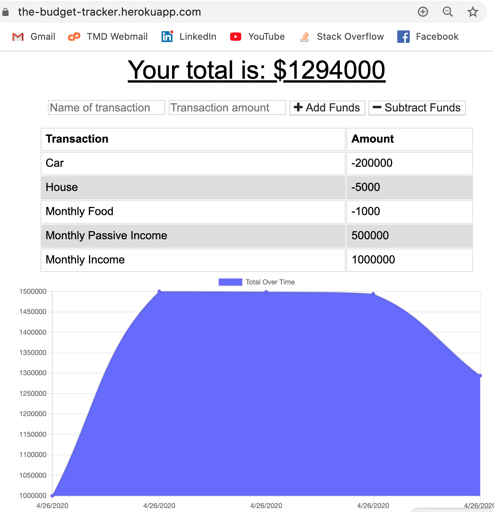

# PWA - Budget Tracker

This [Progressive Web App](https://developer.mozilla.org/en-US/docs/Web/Progressive_web_apps) will track your budget online and offline, no matter where you are.

A PWA has the following features:

* __Progressive__: with older browsers, the application will still work as a normal web app, without delivering any progressive function.

* __Works offline__: with service workers we can decide which assets or data requests to cache and make available when the user is offline or on low quality networks.

* __Safe__: Service workers can only be installed using a secure connection (HTTPS or localhost).

* __Re-engage__: web notifications increase user re-engagement and they work in the background. We can reach users even when the application is closed.

* __Installable__: the web app manifest allows a PWA to be installed on the user's device home screen.

* __Responsive__: fits the screen of any device: desktop, mobile or tablet.

## App Screenshot

In this project, I added functionality to an existing Budget Tracker application to allow offline access and functionality.

Now, the user is able to add expenses and deposits to the budget with or without an Internet connection. When entering transactions offline, they should populate the total when brought back online.

__Offline Functionality__:

  * Enter deposits offline.
  * Enter expenses offline.
  * Save files locally in browser's .
  * Save data locally in indexedDB.
  * Service worker intercepts communication between app and database. 

__Online Functionality__:

  * Offline entries are added to tracker automatically.

- - -

## Deployed Application URL 

[Heroku - PWA Budget Tracker](https://the-budget-tracker.herokuapp.com/)

- - -

## Github repository URL 

[GitHub Repo - PWA Budget Tracker](https://github.com/tomaspz/pwa-budget-tracker)

- - -
## Technologies 

* [HTML, CSS, JAVASCRIPT](https://html-css-js.com/), which are the 3 main technologies of the web in the client side.
* [NODE JS](https://nodejs.org/en/) a JavaScript runtime built on Chrome's V8 JavaScript engine.
* [EXPRESS JS](https://expressjs.com/) is a minimal and flexible Node.js web application framework that provides a robust set of features for web and mobile applications. It creates a ligthweight, but very efficient, web server.
* [DOTENV](https://www.npmjs.com/package/dotenv) is an npm package that loads environment variables from a `.env` file into `process.env`. Storing configuration in the environment separate from code is based on The Twelve-Factor App methodology.
* [MONGODB](https://www.mongodb.com/) is a general purpose, document-based, distributed database built for modern application developers and for the cloud era.
* [MONGOOSE JS](https://mongoosejs.com/) is an npm package that allows elegant mongodb object modeling for node.js.
* [INDEXEDDB WEB API](https://developer.mozilla.org/en-US/docs/Web/API/IndexedDB_API) is a low-level API for client-side storage of significant amounts of structured data, including files/blobs. This API uses indexes to enable high-performance searches of this data.
* [PWA (Progressive Web Application)](https://developer.mozilla.org/en-US/docs/Web/Progressive_web_apps) are web apps that use emerging web browser APIs and features along with traditional progressive enhancement strategy to bring a native app-like user experience to cross-platform web applications.

- - -
## User Story

AS A user
I WANT to be able to track my withdrawals and deposits with or without a data/internet connection
SO THAT my account balance is accurate when I am traveling

As a business traveler
I WANT a fast and easy way to track the money and access the information anytime and anywhere, 
SO THAT I can work offline and have the same functionality.

AS a user 
I WANT to work on the Budget App without an internet connection
AND WHEN I input any budget transaction (withdrawal, deposit, etc)
THEN I WANT the transacton to be shown on the page, 
AND AUTOMATICALLY ADDED to the database when the connection is back online.